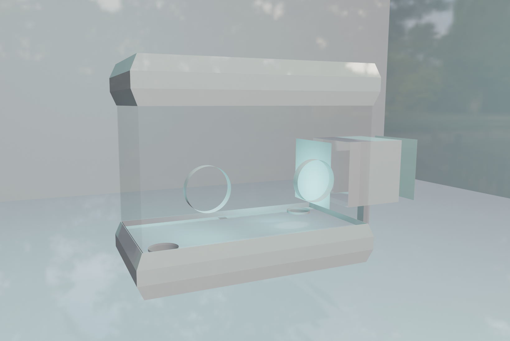

<h1 align="center">Bio-Silicon Synergetic Intelligence System</h1>

  

  

  

  

 
 

## 🧠 Project Overview
At Synthetic Intelligence Labs, our mission is to harmonize biological cognition with computational rigor. We have embarked on an innovative venture that intricately fuses human cortical organoids with rat brains, unveiling a new era of bio-silicon synergetic learning. Our bespoke BCI system is a testament to this, with carbon nanotube-coated electrodes at its core, enhancing the fidelity of neural interfacing through self-optimizing signal pathways.

Our methodology is deeply rooted in bidirectional communication, leveraging AI to map cerebral signals onto interactive platforms, exemplified by our translation of neural impulses into gameplay dynamics. This iterative learning cycle commences at the cortical interface, progressing through a FreeEEG32 board, culminating in our custom software, and returning electrical signals back to the brain. Here, our GUI provides an immersive analytical experience, inclusive of innovative visualizations such as the phase synchronization vortex.

[**Documentation**](https://unlimited-research-cooperative.github.io/Bio-Silicon-Synergetic-Intelligence-System/)

## System Configuration

- **Brain Surface Communication**: Neural activities are mapped via AI, translating into game movements and vice versa.
- **Signal Transmission**: The process begins with brain surface signals, read from our MEA, transmitted through a FreeEEG32 board, to BrainFlow for acquisition, then into our custom software for analysis.
- **Neuromimetic Feedback**: Neural signals are decoded into game actions, with game and in-game action data (facilitating a self-loop learning concept) encoded back into neuromimetic signals. These signals are then fed back into the rat brain.
- **Signal Processing**: The signals are sent to a usb hub, connected to modified usb-audio converters, followed by resistors for voltage division to match ECoG voltage levels.

## Microelectrode Array (MEA) Specifications

### Electrode Specifications

- **Wire Gauge**: 30 AWG (254.6 micrometers diameter).
- **Temporal Resolution**: 512hz

### Encasement and Design

- **Material**: Medical-grade silicone for flexibility and biocompatibility.
- **Thickness**: 0.1 mm, accommodating brain tissue growth.
- **Shape**: Two connected trapezoids for conforming to brain curvature.
- **Wiring**: Twisted pair configuration for each electrode, reducing interference.

## Additional Experiments

- **Self-Organizing Neural Interface Materials**: We will experiment with various combinations of multiwall carbon nanotubes, chitosan, collagen, whey, and Lactobacillus, to observe any improvements with the learning. The Lactobacillus is included to test the hypothesis of possible bio based neural interfacing between electrodes and neurons.
- **Psilocybin for Neural Plasticity**: We will also experiment with administering Psilocybin to the rats orally to test our hypothesis of possible system improvement through Psilocybin consumption correlated to neural plasticity.

### Papers:
- [**Phase 1**](https://www.researchgate.net/publication/379048160_Bio-Silicon_Synergetic_Intelligence_System_Phase_1_Software_Development_and_Prospective_Implantation_of_Microelectrode_Arrays_and_Human_Cortical_Organoids_into_Rat_Brains
): Bio-Silicon Synergetic Intelligence System (Phase 1): Software Development and Prospective Implantation of Microelectrode Arrays and Human Cortical Organoids into Rat Brains

## Rat and Computer Learning

The system we've developed intricately blends advanced software automation with a nuanced understanding of rat behavior and neuroscience. Central to this system is the dual approach of reward and deterrent signaling, tailored specifically for the rat's unique sensory and cognitive processing.

Reward Mechanism: At the heart of positive reinforcement, our automated fluidics system is programmed to deliver a carefully formulated reward solution to the rat. This concoction, a precise blend of sucrose, sodium chloride, nicotine, and caffeine, is designed to stimulate the rat's reward centers, promoting engagement and positive response patterns. This aspect of the system is critical for encouraging the desired behaviors in the rat through natural, positive stimuli.

Deterrent Signaling: Complementing the reward system is the deterrent mechanism, which employs audio signals beyond human auditory perception to subtly influence the rat's behavior. These human-inaudible distress sounds are calibrated to create a mild sense of unease or alertness in the rat, without causing undue stress or harm. This auditory deterrent is a key component in shaping the rat's behavior, helping to guide it away from undesirable actions or responses.

AI-Driven Supervised Learning Framework: The convergence of these two systems is overseen and optimized by our sophisticated AI software. This AI component initiates the process through a phase of supervised learning, wherein incoming neural signals and corresponding actions are meticulously analyzed. The system then generates metadata-rich outgoing signals, which are fine-tuned to enhance the learning and adaptation process. This initial phase of supervised learning is crucial for establishing a robust foundation for the system's AI to learn, adapt, and evolve in response to the rat's neural patterns and behaviors.

In essence, our system represents a harmonious fusion of biotechnology and artificial intelligence, designed to explore and expand the boundaries of neuroscientific research and animal behavior understanding. This dynamic, responsive system is poised to offer unprecedented insights into neural processing, learning mechanisms, and the complex interplay between biological entities and computational intelligence.

## DOOM system

In our system, we will leverage the combined capabilities of VizDoom and Gymnasium to access and utilize comprehensive game state information for effective decision-making and analysis. VizDoom will serve as our primary interface for interacting with the Doom game engine, providing us with rich access to various game state data such as player status, enemy positions, level layouts, weapon information, and observation spaces. Through Gymnasium, we will create custom gym environments tailored to our specific scenarios and objectives, allowing us to seamlessly integrate VizDoom's functionalities into our reinforcement learning pipelines. By harnessing the power of VizDoom and Gymnasium together, we aim to develop robust AI agents capable of understanding and navigating complex game environments, adapting their strategies based on real-time game state observations, and ultimately achieving specified objectives within the Doom universe.

## Rat Health and Wellbeing

Central to our research ethos is the holistic well-being of the rats involved in our study. Recognizing the importance of social structures in the health and well-being of these animals, all rats are housed together in a communal environment. This approach not only supports their social health but also fosters a more natural living condition, crucial for their overall welfare.

Nutrition is another cornerstone of our care regimen. The diet for these rats is meticulously planned and includes a rich variety of superfruits and fish oil supplements. This diet is designed to ensure optimal health, providing essential nutrients and antioxidants that support their cognitive and physical well-being.

Furthermore, our commitment extends beyond the confines of the laboratory. We ensure that all rats exiting our wetlab are in robust health. Their release is carefully orchestrated, with a focus on their long-term welfare. They are released responsibly, in groups, to support their social nature and ease their transition back into a natural habitat. This practice underscores our dedication to ethical research and the humane treatment of all animals involved in our studies.

We invite researchers to join us in this groundbreaking journey, to collaborate and contribute to the evolution of synthetic biological intelligence. Engage with us, and let’s shape the future of brain-computer interfaces together.

### 🚀 Key Features:
- **Tailored BCI & MEA**: Designed specifically for rat brains, enhancing neural connectivity and signal precision.
- **Carbon Nanotube Technology**: Exploits the adaptive capabilities of rat brains and CNTs for superior signal quality.
- **Neural-Computational Language**: Developing a novel symbolic language to streamline brain-computer communication, especially in gaming contexts.

### 🤝 Collaborative Milestones:
- **University of Michigan**: Advancing optical stimulation in "DishBrain" experiment replicas.
- [**FinalSpark**](https://finalspark.com/): Delving into human cortical spheroid learning mechanisms.
- [**University of Reading**](https://sites.google.com/site/complexlivingmachineslab): Innovative use of bacteria in neural networks.
- [**City, University of London**](https://www.pinotsislab.com/): Systems and states, including harmonics in TES EEG data.

## 💡 Inviting Collaboration
We're reaching out to like-minded researchers and innovators to join us on this journey. Your expertise in BCI could be the catalyst for unprecedented breakthroughs. Let's explore the synergy between our visions and set new benchmarks in BCI technology.

### 📢 Join Us:
- **Discord**: Connect with us on [Discord](https://discord.gg/GVyaBEjCY2) and become part of a vibrant community shaping the future.

<h1 align="center">System High Level Schematic</h1>

  

<h1 align="center">Current Software With Modern GUI</h1>

  

<h1 align="center">Biomimetic Signals Generator</h1>

  

<h1 align="center">Biomimetic Signals Overlay</h1>

  

<h1 align="center">Software Data Pipeline</h1>

  

<h1 align="center">Reward System and Feature Mappings</h1>

  

<h1 align="center">Hardware System Design</h1>

  
<h1 align="center">Class III Glovebox Design</h1>

  

## 🤝 Connect
We're more than a project; we're a movement. Let's make history together. [Get in touch](https://github.com/Synthetic-Intelligence-Labs)!

 
 

## 📄 License
This project is licensed under the [Creative Commons Attribution-ShareAlike 4.0 International License](http://creativecommons.org/licenses/by-sa/4.0/).

## 🧬 Related Projects
- [**Human Cortical Organoid Signal Analysis**](https://github.com/Unlimited-Research-Cooperative/human-cortical-organoid-signal-analysis): Signal analysis and prediction of brain signals, adaptable for various signal types. PyPI libraries available from our experiments.
- [**EEG Prediction with Chaos Theory**](https://github.com/Metaverse-Crowdsource/EEG-tES-Chaos-Neural-Net): Leveraging chaos theory and a CNN Kuramoto transformer RNN for signal prediction. Includes PyPI library implementations.
- [**Bacteria Neural Network**](https://github.com/Metaverse-Crowdsource/Bacteria-Neural-Network) _(Upcoming)_: An innovative approach using bacteria as functional components of a neural network. Collaboration between Synthetic Intelligence Labs and Complex Living Machines Lab [Dr. Yoshikatsu Hayashi](https://sites.google.com/site/complexlivingmachineslab)
  
## 📩 Contact
For collaborations, press inquiries, or questions:
- Email: [soul.syrup@yandex.com](mailto:soul.syrup@yandex.com) or [soul.syrupp@gmail.com](mailto:soul.syrupp@gmail.com)
- Discord: soul_syrup

## 📚 Library Testing Invitation
We invite you to test our PyPI library for human brain cortical organoid/spheroid, EEG, ECoG, and other signal analyses:
- [**Neural Signal Analysis Library**](https://pypi.org/project/neural-signal-analysis/0.2.8/) from Synthetic Intelligence Labs.

 Human-Brain-Rat by <a xmlns:cc="http://creativecommons.org/ns#" href="https://github.com/Synthetic-Intelligence-Labs" property="cc:attributionName" rel="cc:attributionURL">Synthetic Intelligence Labs</a> is licensed under a <a rel="license" href="http://creativecommons.org/licenses/by-sa/4.0/">Creative Commons Attribution-ShareAlike 4.0 International License</a>. Based on a work at <a xmlns:dct="http://purl.org/dc/terms/" href="https://github.com/Synthetic-Intelligence-Labs" rel="dct:source">Synthetic Intelligence Labs</a>. Permissions beyond the scope of this license may be available at <a xmlns:cc="http://creativecommons.org/ns#" href="https://github.com/Synthetic-Intelligence-Labs" rel="cc:morePermissions">Synthetic Intelligence Labs</a>.

