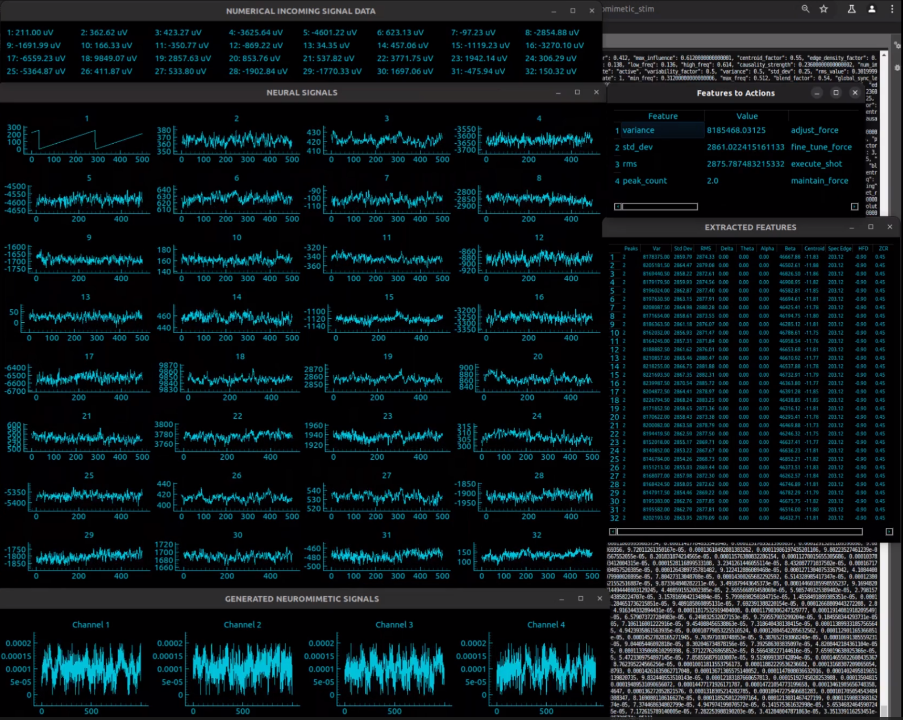

<h1 align="center">Bio-Silicon Synergetic Intelligence System</h1>

<div align="center">
  <a href="https://www.tiktok.com/@synthetic_intelligence">
    
  </a>
</div>

<div align="center">
  <a href="https://discord.gg/weGGNWScUr">
    
  </a>
</div>

<br>
<br>


## 🧠 Project Overview
At Synthetic Intelligence Labs, our mission is to harmonize biological cognition with computational rigor. We have embarked on an innovative venture that intricately fuses human cortical organoids with rat brains, unveiling a new era of bio-silicon synergetic learning. Our bespoke BCI system is a testament to this, with carbon nanotube-coated electrodes at its core, enhancing the fidelity of neural interfacing through self-optimizing signal pathways.

Our methodology is deeply rooted in bidirectional communication, leveraging AI to map cerebral signals onto interactive platforms, exemplified by our translation of neural impulses into gameplay dynamics. This iterative learning cycle commences at the cortical interface, progressing through a FreeEEG32 board, culminating in our custom software, and returning electrical signals back to the brain. Here, our GUI provides an immersive analytical experience, inclusive of innovative visualizations such as the phase synchronization vortex.

[**Documentation**](https://unlimited-research-cooperative.github.io/Bio-Silicon-Synergetic-Intelligence-System/)

SIL-BSIS-01

[](https://github.com/Unlimited-Research-Cooperative/Bio-Silicon-Synergetic-Intelligence-System/blob/main/images/BSIS_research_poster.pdf)

## Open Source Software Usage Instructions

To use this software (open source version), follow these steps:

1. **Download the Software**: 
   Download the software from the following link: [Bio-Silicon Synergetic Intelligence System - Shuffleboard 1D Script-Based System](https://github.com/Unlimited-Research-Cooperative/Bio-Silicon-Synergetic-Intelligence-System/tree/6e07ada38bbe4444384b36da36a1215c6b8c5275/Software/system/shuffleboard_1D/script_based_system/digital_or_analogue_system)

2. **Gather Real Data**: 
   Real data can be gathered from a FreeEEG32 board. You can find more information here: [FreeEEG32](https://github.com/neuroidss/FreeEEG32-beta).

3. **Use Simulation Data**: 
   Alternatively, you can use simulation data from [OpenNeuro](https://openneuro.org/datasets/ds004770/versions/1.0.0). Look for `sub-01_ses-task_task-game_run-01_ieeg.edf` and download it.

4. **Set the EDF File Path**: 
   To simulate the data, you must set the EDF file path in the `SimulateNeuralData` script located in the `digital_or_analogue_system` directory to the correct location in your system. Change the file path after this line:
    ```python
    # Path to your EDF file
    file_path = "path_to_your_edf_file"
     
    
    ```
     
5. **Set the Output USB Audio Ports**:
    Update the output USB audio ports in the script by updating this line:
    ```python
    pyaudio_devices = [18, 19, 20, 21]  # Replace with actual indices if needed
      
 
    ```
 
6. **Set the Correct USB Hub/Port/Relay for Reward Feeder Solenoid Valve Opening:**
    Update the following lines in the script:

    ```python
    hub = "1-1"  # Example hub identifier, replace with your actual hub
    port = "2"   # Example port number, replace with your actual port
    usb_relay = USBRelay("/dev/ttyUSB0")  # Initialize with the correct USB port
     
    
    ```
     
 
7. **Set the Output USB Audio Beep Reward:**
    Update the following line in the script to set the audio device index for the beep reward:

    ```python
    audio_device_index = 9  # Replace with the correct device index that supports audio output
 

    ```
 
8. **Find the Audio Ports:**
If you need to find which audio ports to use as output, you can use the scripts in the following Jupyter notebook:

```
randomstuff/stim_signal_troubleshoot.ipynb
```

9. **Install the Requirements**: 
   Make sure to install all required dependencies at ```digital_or_analogue_system/requirements.txt``` by running the following command in your terminal:
   ```bash
   pip install -r requirements.txt
   ```
    
10. **Run Software**:
    You can then run the software by executing either
   ```run_system_analogue_stim_invivo.py```
   or ```run_system_digital_stim_invivo.py.```

## System Configuration

- **Brain Surface Communication**: Neural activities are mapped via AI, translating into game movements and vice versa.
- **Signal Transmission**: The process begins with brain surface signals, read from our MEA, transmitted through a FreeEEG32 board to BrainFlow for acquisition, then into our custom software for analysis.
- **Analogue Data Encoded Electrical Brain Stimulation**: Neural signals are decoded into game actions. Game and in-game action data are encoded back into analogue electrical signals, which are then fed back into the rat brain.
- **Digital Data Encoded Electrical Brain Stimulation**: Similar to the analogue process, game actions and in-game data are encoded into digital electrical signals and fed back into the rat brain.
- **Signal Processing**: The signals are sent to a USB hub, connected to modified USB-audio converters, followed by resistors for voltage division to match ECoG voltage levels.

## Microelectrode Array (MEA) Specifications

### Electrode Specifications

- **Wire Gauge**: 30 AWG (254.6 micrometers diameter).
- **Temporal Resolution**: 512hz

### Encasement and Design

- **Material**: Medical-grade silicone for flexibility and biocompatibility.
- **Thickness**: 0.1 mm, accommodating brain tissue growth.
- **Shape**: Two connected trapezoids for conforming to brain curvature.

## Additional Experiments

- **Self-Organizing Neural Interface Materials**: We are experimenting with various combinations of multiwall carbon nanotubes, chitosan, collagen, whey, and Lactobacillus to optimize system performance. The inclusion of Lactobacillus is to test the hypothesis of potential bio-based neural interfacing between electrodes and neurons.
- **Psilocybin for Neural Plasticity**: We are also conducting experiments by administering Psilocybin orally to rats. This is to test our hypothesis that Psilocybin consumption may enhance neural plasticity, leading to potential system improvements.

### Papers:
- [**Phase 1**](https://www.researchgate.net/publication/379048160_Bio-Silicon_Synergetic_Intelligence_System_Phase_1_Software_Development_and_Prospective_Implantation_of_Microelectrode_Arrays_and_Human_Cortical_Organoids_into_Rat_Brains
): Bio-Silicon Synergetic Intelligence System (Phase 1): Software Development and Prospective Implantation of Microelectrode Arrays and Human Cortical Organoids into Rat Brains
- [**Preprint draft 1 of hardware and software system**](https://arxiv.org/abs/2407.11939): AI-Driven Bio-Silicon Intelligence System: Integrating Hybrid Systems, Biocomputing, Neural Networks, and Machine Learning, for Advanced Neurotechnology

## Rat and Computer Learning

The system we've developed intricately blends advanced software automation with a nuanced understanding of rat behavior and neuroscience. Central to this system is the dual approach of reward and deterrent signaling, tailored specifically for the rat's unique sensory and cognitive processing.

Reward Mechanism: At the heart of positive reinforcement, our automated fluidics system is programmed to deliver a carefully formulated reward solution to the rat. This concoction, a precise blend of sucrose, sodium chloride, nicotine, and caffeine, is designed to stimulate the rat's reward centers, promoting engagement and positive response patterns. This aspect of the system is critical for encouraging the desired behaviors in the rat through natural, positive stimuli.

Deterrent Signaling: Complementing the reward system is the deterrent mechanism, which employs audio signals beyond human auditory perception to subtly influence the rat's behavior. These human-inaudible distress sounds are calibrated to create a mild sense of unease or alertness in the rat, without causing undue stress or harm. This auditory deterrent is a key component in shaping the rat's behavior, helping to guide it away from undesirable actions or responses.

AI-Driven Supervised Learning Framework: The convergence of these two systems is overseen and optimized by our sophisticated AI software. This AI component initiates the process through a phase of supervised learning, wherein incoming neural signals and corresponding actions are meticulously analyzed. The system then generates metadata-rich outgoing signals, which are fine-tuned to enhance the learning and adaptation process. This initial phase of supervised learning is crucial for establishing a robust foundation for the system's AI to learn, adapt, and evolve in response to the rat's neural patterns and behaviors.

In essence, our system represents a harmonious fusion of biotechnology and artificial intelligence, designed to explore and expand the boundaries of neuroscientific research and animal behavior understanding. This dynamic, responsive system is poised to offer unprecedented insights into neural processing, learning mechanisms, and the complex interplay between biological entities and computational intelligence.


## DOOM System

Our system leverages VizDoom to access and utilize comprehensive game state information for effective decision-making and analysis. VizDoom serves as our primary interface for interacting with the Doom game engine, providing rich access to various game state data such as player status, enemy positions, level layouts, weapon information, observation spaces, and more. By harnessing the power of [VizDoom](https://vizdoom.farama.org/), we aim to develop a robust digital and analogue AI and synthetic biological intelligence system capable of understanding and navigating complex game environments. These system adapts its strategies based on real-time game state observations and ultimately achieve specified objectives within the Doom universe.

## Rat Health and Wellbeing

Central to our research ethos is the holistic well-being of the rats involved in our study. Recognizing the importance of social structures in the health and well-being of these animals, all rats are housed together in a communal environment. This approach not only supports their social health but also fosters a more natural living condition, crucial for their overall welfare.

Nutrition is another cornerstone of our care regimen. The diet for these rats is meticulously planned and includes a rich variety of superfruits and fish oil supplements. This diet is designed to ensure optimal health, providing essential nutrients and antioxidants that support their cognitive and physical well-being.

Furthermore, our commitment extends beyond the confines of the laboratory. We ensure that all rats exiting our wetlab are in robust health. Their release is carefully orchestrated, with a focus on their long-term welfare. They are released responsibly, in groups, to support their social nature and ease their transition back into a natural habitat. This practice underscores our dedication to ethical research and the humane treatment of all animals involved in our studies.


We invite researchers to join us in this groundbreaking journey, to collaborate and contribute to the evolution of synthetic biological intelligence. Engage with us, and let’s shape the future of brain-computer interfaces together.


### 🚀 Key Features:
- **Tailored BCI & MEA**: Designed specifically for rat brains, enhancing neural connectivity and signal precision.
- **Carbon Nanotube Technology**: Exploits the adaptive capabilities of rat brains and CNTs for superior signal quality.
- **Neural-Computational Language**: Developing a novel symbolic language to streamline brain-computer communication, especially in gaming contexts.


### 🤝 Collaborative Milestones:
- **University of Michigan**: Advancing optical stimulation in "DishBrain" experiment replicas.
- [**FinalSpark**](https://finalspark.com/): Delving into human cortical spheroid learning mechanisms.
- [**University of Reading**](https://sites.google.com/site/complexlivingmachineslab): Innovative use of bacteria in neural networks.
- [**City, University of London**](https://www.pinotsislab.com/): Systems and states, including harmonics in TES EEG data.

## 💡 Inviting Collaboration
We're reaching out to like-minded researchers and innovators to join us on this journey. Your expertise in BCI could be the catalyst for unprecedented breakthroughs. Let's explore the synergy between our visions and set new benchmarks in BCI technology.


### 📢 Join Us:
- **Discord**: Connect with us on [Discord](https://discord.gg/GVyaBEjCY2) and become part of a vibrant community shaping the future.


</p>
<h1 align="center">System High Level Schematic</h1>
<p align="center">
  
</p>
<h1 align="center">System High Level Schematic 2</h1>
<p align="center">
  
</p>
<h1 align="center">Neural Signals Visualiser</h1>
<p align="center">
  
</p>
<h1 align="center">Feature Extractor Visualiser</h1>
<p align="center">
  
</p>
<h1 align="center">Features and Subfeatures to Game Action Mapping Visualiser</h1>
<p align="center">
  
</p>
<h1 align="center">Game Force Adjustments and Distance to Target Over Time Visualiser</h1>
<p align="center">
  
</p>
<h1 align="center">Analogue Signal (Neuromimetic) Electrical Stimulation Visualiser</h1>
<p align="center">
  
</p>
<h1 align="center">Digital Signal (Binary) Electrical Stimulation Visualiser</h1>
<p align="center">
  
</p>
<h1 align="center">Physics Informed Hybrid Hierarchical Reinforcement Learning State Machine</h1>
<p align="center">
      
</p>
<h1 align="center">Open Source Software Data Pipeline</h1>
<p align="center">
  
</p>
<h1 align="center">Open Source Reward System and Feature Mappings</h1>
<p align="center">
  
</p>
<h1 align="center">Open Source Hardware System Design</h1>
<p align="center">
  
</p>
<h1 align="center">Proprietary System Design Overview</h1>
<p align="center">
  
</p>

## 🤝 Connect
We're more than a project; we're a movement. Let's make history together. [Get in touch](https://github.com/Synthetic-Intelligence-Labs)!

<br>
<br>

## 📄 License
This project is licensed under the [Creative Commons Attribution-ShareAlike 4.0 International License](http://creativecommons.org/licenses/by-sa/4.0/).

## 🧬 Related Projects
- [**Human Cortical Organoid Signal Analysis**](https://github.com/Unlimited-Research-Cooperative/human-cortical-organoid-signal-analysis): Signal analysis and prediction of brain signals, adaptable for various signal types. PyPI libraries available from our experiments.
- [**EEG Prediction with Chaos Theory**](https://github.com/Metaverse-Crowdsource/EEG-tES-Chaos-Neural-Net): Leveraging chaos theory and a CNN Kuramoto transformer RNN for signal prediction. Includes PyPI library implementations.
- [**Bacteria Neural Network**](https://github.com/Metaverse-Crowdsource/Bacteria-Neural-Network) _(Upcoming)_: An innovative approach using bacteria as functional components of a neural network. Collaboration between Synthetic Intelligence Labs and Complex Living Machines Lab [Dr. Yoshikatsu Hayashi](https://sites.google.com/site/complexlivingmachineslab)
  
## 📩 Contact
For collaborations, press inquiries, or questions:
- Email: [info@syntheticintelligencelabs.com](mailto:info@syntheticintelligencelabs.com)


## 📚 Library Testing Invitation
We invite you to test our PyPI library for human brain cortical organoid/spheroid, EEG, ECoG, and other signal analyses:
- [**Neural Signal Analysis Library**](https://pypi.org/project/neural-signal-analysis/0.2.8/) from Synthetic Intelligence Labs.

<a rel="license" href="http://creativecommons.org/licenses/by-sa/4.0/"></a><br /><span xmlns:dct="http://purl.org/dc/terms/" property="dct:title">Human-Brain-Rat</span> by <a xmlns:cc="http://creativecommons.org/ns#" href="https://github.com/Synthetic-Intelligence-Labs" property="cc:attributionName" rel="cc:attributionURL">Synthetic Intelligence Labs</a> is licensed under a <a rel="license" href="http://creativecommons.org/licenses/by-sa/4.0/">Creative Commons Attribution-ShareAlike 4.0 International License</a>.<br />Based on a work at <a xmlns:dct="http://purl.org/dc/terms/" href="https://github.com/Synthetic-Intelligence-Labs" rel="dct:source">Synthetic Intelligence Labs</a>.<br />Permissions beyond the scope of this license may be available at <a xmlns:cc="http://creativecommons.org/ns#" href="https://github.com/Synthetic-Intelligence-Labs" rel="cc:morePermissions">Synthetic Intelligence Labs</a>.

